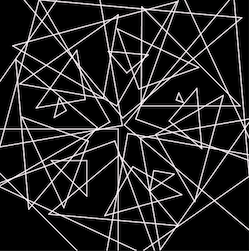
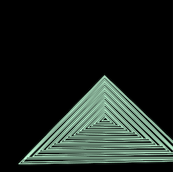

# Triangle Picasso

I made this little Processing visualizer in 2013 as one of my first assignments in CS101 at NYU.
It draws triangles whose position and color change based on the position of the mouse. Useful!

It's written in Java and using the Processing library's PApplet to draw the visualization.

Users prone to nausea should use at their own risk and click for a breather.

## Running Instructions
- Make sure you are running Java 8 as the processing library doesn't seem to work with anything newer
- Run `mvn clean compile assembly:single` to create a jar with the processing dependency
- Run the jar: `java -jar target/picasso-1.0-SNAPSHOT-jar-with-dependencies.jar`

 
